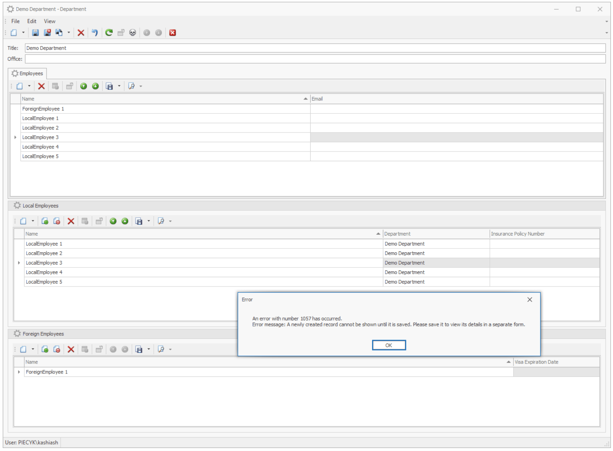

# DescendantCollectionstest

based on devexpress xaf example: https://supportcenter.devexpress.com/ticket/details/e975/how-to-display-detail-collections-with-descendants-filtered-by-an-object-type


After remove      remove[ModelDefault("AllowEdit", "False")] i can add records to descendant collections but there department is not stored.

```csharp
protected override XPCollection<T> CreateCollection<T>(XPMemberInfo property)
     {
         XPCollection<T> collection = base.CreateCollection<T>(property);
         if (property.Name == "Employees")
         {
             collection.CollectionChanged += collectionEmployees_CollectionChanged;
         }

         if (property.Name == "ForeignEmployees")
         {
             collection.CollectionChanged += collectionForeignEmployees_CollectionChanged;
         }

         if (property.Name == "LocalEmployees")
         {
             collection.CollectionChanged += collection_LocalEmployeesCollectionChanged;
         }
         return collection;
     }

     private void collection_LocalEmployeesCollectionChanged(object sender, XPCollectionChangedEventArgs e)
     {
         ProceessChange(e);
     }

     private void collectionForeignEmployees_CollectionChanged(object sender, XPCollectionChangedEventArgs e)
     {
         ProceessChange(e);
     }

     void collectionEmployees_CollectionChanged(object sender, XPCollectionChangedEventArgs e)
     {
         ProceessChange(e);
     }

     private void ProceessChange(XPCollectionChangedEventArgs e)
     {
         if (e.CollectionChangedType == XPCollectionChangedType.AfterAdd || e.CollectionChangedType == XPCollectionChangedType.AfterRemove)
         {
             var employee = e.ChangedObject as EmployeeBase;
             if (employee != null)
             {
                 employee.Department = this;
             }
         }
     }
```


but while debugging i realized that CreateCollection is not called for my descendant collection:


```csharp
...
XPCollection<T> collection = base.CreateCollection<T>(property);
if (property.Name == "Employees")
{
    collection.CollectionChanged += collectionEmployees_CollectionChanged;
}

if (property.Name == "ForeignEmployees")
{
    //this never happens
    collection.CollectionChanged += collectionForeignEmployees_CollectionChanged;
}

if (property.Name == "LocalEmployees")
{
    //this never happens
    collection.CollectionChanged += collection_LocalEmployeesCollectionChanged;
}
...
```


The question is how to process this event for descendant collect  if it is not fired ?

Now I'm trying to another direction: controller on EmployeeBase  newObjectCreated:

```csharp
public class EmployeeBaseViewController : ObjectViewController<ListView, EmployeeBase>
{


    private NewObjectViewController newObjectViewController;


    protected override void OnActivated()
    {
        base.OnActivated();
        NestedFrame nestedFrame = Frame as NestedFrame;
        if (nestedFrame != null)
        {
            newObjectViewController = Frame.GetController<NewObjectViewController>();
            newObjectViewController.ObjectCreated += newObjectViewController_ObjectCreated;

        }
    }

    void newObjectViewController_ObjectCreated(object sender, ObjectCreatedEventArgs e)
    {
        var objectSpace = e.ObjectSpace;
        var parent = objectSpace.GetObject(((NestedFrame)Frame).ViewItem.CurrentObject as Department);
        var item = e.CreatedObject as EmployeeBase;
        item.Department = parent;
    }
}
```


Now I can Add records to descendant collections and parent is assigned!

but ...

I have in department simple action where i add few local (or foreign )employees:

```csharp
public  class DepartmentDetailViewController : ObjectViewController<DetailView, Department>
  {

      SimpleAction simpleAction;
      public DepartmentDetailViewController()
      {
          simpleAction = new SimpleAction(this, $"{ GetType().FullName}{nameof(simpleAction) }", DevExpress.Persistent.Base.PredefinedCategory.Unspecified)
          {

              Caption = "Add local employees",
              ImageName="BO_Skull",
          };
          simpleAction.Execute += SimpleAction_Execute;
      }

      private void SimpleAction_Execute(object sender, SimpleActionExecuteEventArgs e)
      {

            var dept = View.CurrentObject as Department;
            LocalEmployee le2 = ObjectSpace.CreateObject<LocalEmployee>();
            le2.Department = dept;
            le2.Name = "LocalEmployee 2";
            LocalEmployee le3 = ObjectSpace.CreateObject<LocalEmployee>();
            le3.Name = "LocalEmployee 3";
            le3.Department = dept;
            LocalEmployee le4 = ObjectSpace.CreateObject<LocalEmployee>();
            le4.Name = "LocalEmployee 4";
            le4.Department = dept;
            LocalEmployee le5 = ObjectSpace.CreateObject<LocalEmployee>();
            le5.Name = "LocalEmployee 5";
            le5.Department = dept;


            dept.LocalEmployees.AddRange(new LocalEmployee[] { le2, le3,le4,le5 });

            View.FindItem("Employees").Refresh();
            View.FindItem("LocalEmployees").Refresh();
            ObjectSpace.SetModified(View.CurrentObject);
      }
  }
```


now i can add many records from action ... but when try to edit this record in local employees list i get error:  A newly created record cannot be shown until it is saved. (When trying do the same on Employees collection this error doesnt happens!). 




Ok! i know this error - it is by design, i change my descendant collections to be aggregated.


```csharp
private XPCollection<LocalEmployee> _LocalEmployees;
// [ModelDefault("AllowEdit", "False")]
[Aggregated]
public XPCollection<LocalEmployee> LocalEmployees {
    get {
        if (_LocalEmployees == null)
            _LocalEmployees = new XPCollection<LocalEmployee>(Session,
                new GroupOperator(
                new BinaryOperator(BaseObject.Fields.ObjectType.TypeName, new OperandValue(typeof(LocalEmployee).FullName), BinaryOperatorType.Equal),
                new BinaryOperator("Department", this)));
        return _LocalEmployees;
    }
}
private XPCollection<ForeignEmployee> _ForeignEmployees;
// [ModelDefault("AllowEdit", "False")]
[Aggregated]
public XPCollection<ForeignEmployee> ForeignEmployees {
    get {
        if (_ForeignEmployees == null)
            _ForeignEmployees = new XPCollection<ForeignEmployee>(Session,
                new GroupOperator(
                new BinaryOperator(BaseObject.Fields.ObjectType.TypeName, new OperandValue(typeof(ForeignEmployee).FullName), BinaryOperatorType.Equal),
                new BinaryOperator("Department", this)));
        return _ForeignEmployees;
    }
}
```

It very close to success, but ... when i delete any record on child list, then local employees list is cleared
like in this screen cast:
https://www.youtube.com/watch?v=m9GcF_8cqrM

how to refresh local collection ?

sample project is at github: https://github.com/kashiash/DescendantCollectionstest.git

Continuing:

I guess this can be exactly the same problem:

I add Organization class which contains collection of Departments:

```csharp
[DefaultClassOptions]
public class Organization : XPObject
{
    public Organization(Session session) : base(session)
    { }


    string organizationName;

    [Size(SizeAttribute.DefaultStringMappingFieldSize)]
    public string OrganizationName
    {
        get => organizationName;
        set => SetPropertyValue(nameof(OrganizationName), ref organizationName, value);
    }


    [Association("Organization-Departments"),Aggregated]
    public XPCollection<Department> Departments
    {
        get
        {
            return GetCollection<Department>(nameof(Departments));
        }
    }
```


Now i'm adding:

1. New organization
2. new department
3. add local employees by action or by insert by detail view, and save and close on department DV
4. reenter into department DV. Employees collection has records, but LocalEmployees is empty - How to refresh it ?

5. Save departemt, save organization
6 reenter organization and reenter department - Local Employees are visible

See the screen cast:
https://www.youtube.com/watch?v=UucblyT2GCk


The main goal is to allow user to add/modify records on descendant collections, and refresh these collection event this is not persistent in database ?


